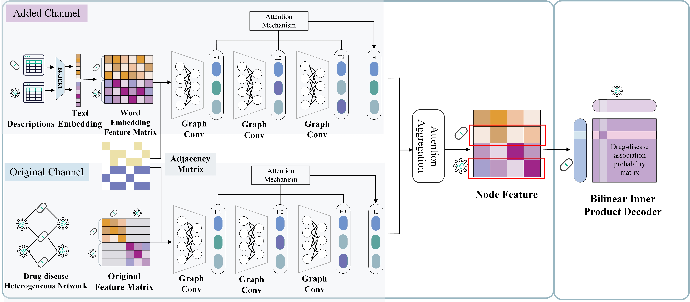

# LAGCN-LLM
> Code and Datasets for "Large Language Models for Biomedical Network Augmentation: An Example in Drug–Disease Associations Prediction through A Dual-Channel Layer Attention Graph Convolutional Network"

Author: Zidu Xu (znx2000)



# The original work - LAGCN
> Code and Datasets for "Predicting Drug-Disease Associations through Layer Attention Graph Convolutional Networks" https://doi.org/10.1093/bib/bbaa243
## Datasets
- data/drug_dis.csv is the drug_disease association matrix, which contain 18416 associations between 269 drugs and 598 diseases.

- data/drug_sim.csv is the drug similarity matrix of 269 diseases,which is calculated based on drug target features.

- data/dis_sim.csv is the disease similarity matrix of 598 diseases,which is calculated based on disease mesh descriptors.

- feat/drug_desc.csv is the drug descriptions generated by GPT-4 of 269 diseases,which is calculated based on drug target features.

- feat/disease_desc.csv is the disease descriptions generated by GPT-4 of 598 diseases,which is calculated based on disease mesh descriptors.

## Code
### Environment Requirement
The code has been tested running under Python 3.6.8. The required packages are as follows:
- python == 3.9
- tensorflow == 2.10

### Usage

-  eval.ipynotebook: Evaluates the performance of the model in 5-fold CV experiment.

-  main.py: This is the main execution file that initiates the model development process.

-  model.py: Contains code to define the predictive model architecture.

-  desc_gen.ipynotebook: GPT-4 prompt.

-  biobert_emb.py: Biobert embedding.

-  layers.py: Defines each layer of the neural network. Only the GraphConvolution2 layer is used in the current model.

-  utils.py: basic functions.

-  clac_metric: Computes various performance metrics such as Area Under the Precision-Recall Curve (AUPR), Area Under the Receiver Operating Characteristic Curve (AUC), F1 score, accuracy, recall, specificity, and precision.

- clr.py: Cyclic learning rate.

- opt.py: Optimizer.

### Results

- results_LLM: The preidction results of the LAGCN-LLM model 

- results_origin: The preidction results of the LAGCN model

- model weights: The model weights of the LAGCN-LLM model

- metrics_output: The performance metrics of the model comparison experiment

```
E4040_2023_final_LAGCN-LLM_znx2000
|   README.md
|   
+---code
|   |   biobert_emb.py
|   |   clac_metric.py
|   |   clr.py
|   |   desc_gen.ipynb
|   |   eval.ipynb
|   |   layers.py
|   |   main.py
|   |   model.py
|   |   opt.py
|   |   utils.py
|   |   
|   \---.idea
|       |   .gitignore
|       |   code.iml
|       |   misc.xml
|       |   modules.xml
|       |   workspace.xml
|       |   
|       \---inspectionProfiles
|               profiles_settings.xml
|               Project_Default.xml
|               
+---data
|   \---B-dataset
|           dis_sim.csv
|           drug_dis.csv
|           drug_sim.csv
|           
+---feat
|       desease_desc.csv
|       disease_embeddings.pkl
|       drug_desc.csv
|       drug_embeddings.pkl
|       
+---paper
|       E4040_2023Fall_DGCN_report_znx2000.pdf
|       fig2.jpg
|       fig3.jpg
|       
\---result
    +---metrics_output
    |       comparison_table.csv
    |       LLM_aggregated_statistics.csv
    |       LLM_individual_metrics.csv
    |       metrics_comparison.png
    |       origin_aggregated_statistics.csv
    |       origin_individual_metrics.csv
    |       roc_pr_curves.png
    |       
    +---model_weights
    |       
    +---result_LLM
    |       prediction_0.npy
    |       prediction_1.npy
    |       prediction_2.npy
    |       prediction_3.npy
    |       prediction_4.npy
    |       prediction_5.npy
    |       prediction_6.npy
    |       prediction_7.npy
    |       prediction_8.npy
    |       prediction_9.npy
    |       
    \---result_origin
            prediction_0.npy
            prediction_1.npy
            prediction_2.npy
            prediction_3.npy
            prediction_4.npy
            prediction_5.npy
            prediction_6.npy
            prediction_7.npy
            prediction_8.npy
            prediction_9.npy
            


```