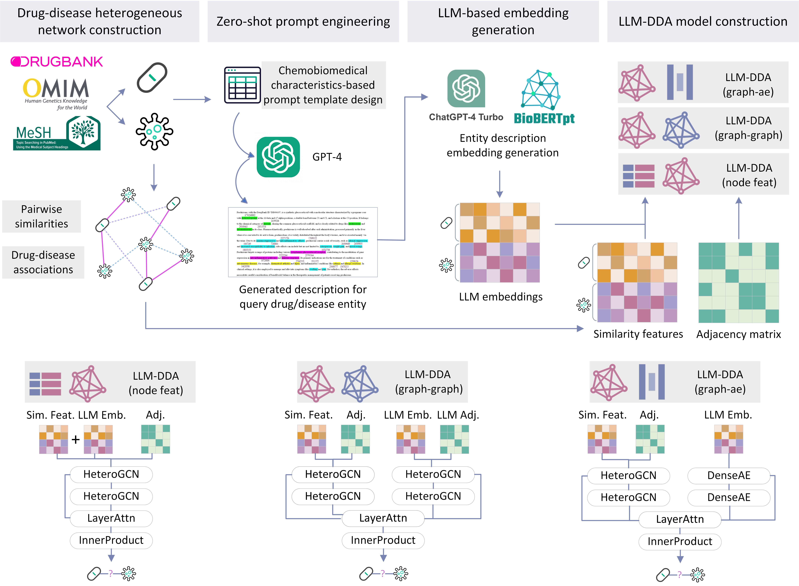

# LLM-DDA


> Code for "Empowering graph neural network-based computational drug repositioning with large language model-inferred knowledge representation"



## Datasets
We introduce 4 drug-disease association benchmark datasets in our study, including: [**B-dataset**](https://link.springer.com/article/10.1186/s12859-018-2220-4), [**C-dataset**](https://academic.oup.com/bioinformatics/article/32/17/2664/2450730), [**F-dataset**](https://www.embopress.org/doi/full/10.1038/msb.2011.26), and [**R-dataset**](https://www.sciencedirect.com/science/article/pii/S0010482522008356). Dataset summary is as follows:

| Dataset   | Drugs | Diseases | Drug-disease Associations | Pos-Neg Ratio |
|-----------|-------|----------|--------------------------|---------------|
| B-dataset | 269   | 598      | 18,416                   | 11.45%        |
| C-dataset | 663   | 409      | 2,532                    | 1.57%         |
| F-dataset | 593   | 313      | 1,933                    | 1.05%         |
| R-dataset | 894   | 454      | 2,704                    | 0.67%         |

## LLM templates
Please find the designed zero-shot template for GPT-4 to generate drug and disease knowledge descriptions in ```gpt.ipynb```.

## LLM-inferred knowledge representations
To generate LLM-inferred knowledge representations, please refer ```generate_emb.py```. Also, we have stored generated embedding files for B-dataset, C-dataset, F-dataset, and R-dataset, please find them in "**feat**" folder. Specifically, ```LLM_drug_emb.pkl``` and ```LLM_disease_emb.pkl``` are generated embeddings from GPT-4; ```BERT_drug_emb.pkl``` and ```BERT_disease_emb.pkl``` are generated embeddings from BioBERT.

## Code

### Environment Requirement
- `torch`: 1.13.0+cu117
- `scikit-learn`: 1.2.2
- `rdkit`: 2023.3.3
- `dgl`: 1.1.2+cu117

### Cross-Validation
```
python main.py -sp {SAVE_PATH} -da {DATASET} -fo {NUM_FOLD} -se {SEED} -ft {LLM_EMB} -ct {MODEL_TYPE} -id {DEVICE} -ep {EPOCH} -dp {DROPOUT} -hf {HIDDEN_FEAT}
```
Suggested setting:
```
python main.py -sp {SAVE_PATH} -da {DATASET} -fo 5 -se 0 -ft LLM -ct graph_ae -id 0 -ep 5000 -dp 0.4 -hf 128
```

## Citation
TBD
